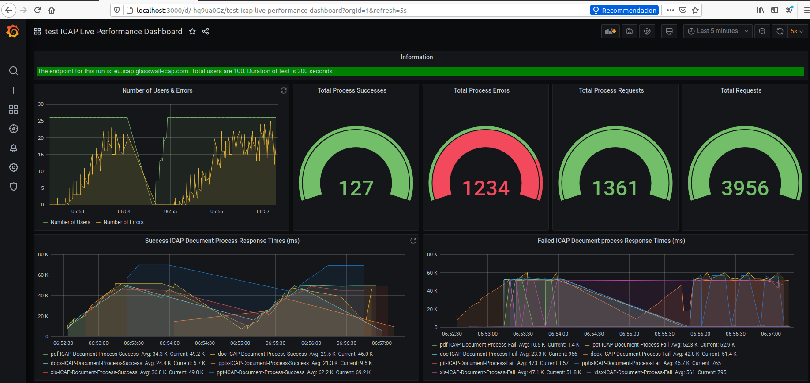
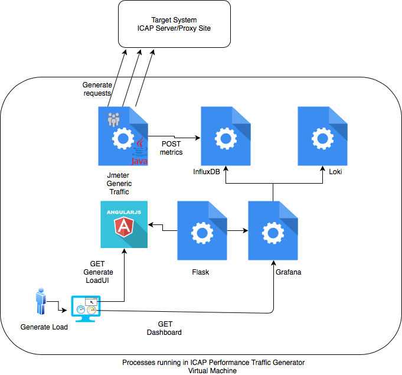

# How to generate Load with OVA using command line

For OVA deployment follow the instructions in ["How to deploy OVA"](How%20to%20deploy%20OVA.md)

1. Open a new terminal tab and run the following:
```
    kubectl port-forward -n common service/minio-service 9000:80
```
In another terminal tab
```
    kubectl port-forward -n common service/grafana-service 3000:80
```
2. Open the Mozilla browser and navigate to the following pages 
Minio http://localhost:9000
Grafana http://localhost:3000
3. Open a new terminal tab and run the following:
```
    cd ~/scripts
```
Here make sure the parameters passed to the master script are correct
```
    cat config.env
```
Here are the expected settings:
```
    AWS_PROFILE_NAME=default
    REGION=eu-west-1
    TOTAL_USERS=100
    USERS_PER_INSTANCE=25
    DURATION=300
    TEST_DATA_FILE=gov_uk_files.csv
    MINIO_URL=http://minio-service.common:80
    MINIO_ACCESS_KEY=admin
    MINIO_SECRET_KEY=admin@123
    MINIO_INPUT_BUCKET=icap-performance-test-data-bucket
    MINIO_OUTPUT_BUCKET=output
    INFLUXDB_URL=http://influxdb-service.common:80
    PREFIX=test
    ICAP_SERVER_URL=eu.icap.glasswall-icap.com
    GRAFANA_URL=localhost:3000
    GRAFANA_API_KEY=eyJrIjoiZE9FWGt5MDl6Qld4VlhzcHd3TzVyWGh3MUJZZzkyNmEiLCJuIjoiSk1ldGVyIHRlc3QiLCJpZCI6MX0=
    GRAFANA_FILE=../grafana_dashboards/k8-test-engine-dashboard.json
    EXCLUDE_DASHBOARD=0
    PRESERVE_STACK=0
    ICAP_SERVER_PORT=1344
    ENABLE_TLS=0
    TLS_VERIFICATION_METHOD=no-verify
```
Then run the master script
```
    sudo python3 create_stack_dash.py 
```
The output should look as follows:
```
    Creating Load Generators...
    INFO:create_stack:TOTAL USERS         100
    INFO:create_stack:USERS PER INSTANCE  25
    INFO:create_stack:TEST DURATION       300
    INFO:create_stack:FILE LIST           ../testdata/files01.csv
    INFO:create_stack:MINIO URL           http://minio-service.common:80
    INFO:create_stack:MINIO INPUT BUCKET  input
    INFO:create_stack:MINIO outPUT BUCKET output
    INFO:create_stack:INFLUXDB URL        http://influxdb-service.common:80
    INFO:create_stack:INFLUX HOST         influxdb-service.common
    INFO:create_stack:PREFIX              demo
    INFO:create_stack:ICAP SERVER         gw-icap02.westeurope.azurecontainer.io
    Client Version: version.Info{Major:"1", Minor:"19+", GitVersion:"v1.19.3-34+a56971609ff35a", GitCommit:"a56971609ff35ac8cc90b2aef89165208bff3fe1", GitTreeState:"clean", BuildDate:"2020-11-06T11:56:24Z", GoVersion:"go1.15.3", Compiler:"gc", Platform:"linux/amd64"}
    Server Version: version.Info{Major:"1", Minor:"19+", GitVersion:"v1.19.3-34+a56971609ff35a", GitCommit:"a56971609ff35ac8cc90b2aef89165208bff3fe1", GitTreeState:"clean", BuildDate:"2020-11-06T11:57:19Z", GoVersion:"go1.15.3", Compiler:"gc", Platform:"linux/amd64"}
    INFO:create_stack:Micro k8s           True
    No resources found
    secret/jmeterconf created
    secret/filesconf created
    INFO:create_stack:Number of pods to be created: 4
    job.batch/demo-jmeterjob created
    Creating dashboard...
    Dashboard created at: 
    http://localhost:3000/d/cfbjZi0Mz/demo-icap-live-performance-dashboard
    Stack will be deleted after 20.0 minutes
    0.0 minutes have elapsed, stack will be deleted in 20.0 minutes
```
4. At the moment Grafana is supposed to have a newly created dashboard whose name starts with the `PREFIX` value passed to the master script in config.env. <br/>
<br/>
Open the dashboard and watch a visualization of the running test <br/>
<br/>
## How to generate Load with the UI

The following diagram shows generic view of what processes are running and how are they connected:



The load/traffic generator comes with 2 features:

- Load Generation Capability
- Performance Dashboard
